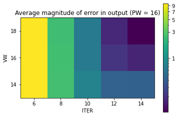

# Function generator

This is a 2-channel function generator capable of generating

1) Sinusoidal
2) Sawtooth
3) Square

Waves of different specifications. The sinusoidal waves are generated using a CORDIC core which is multiplexed between the two channels (if both are generating sinusoidal outputs). 

This was done as part of the *Digital System Design for FPGAs* course offered by Prof. Kuruvilla Varghese at DESE, IISc Bangalore (Jan-Apr 2023)

# Toplevel architecture

The system is controlled by a set of 5 registers for each channel. They are

1) **Step size** : Increment of the counter in every (valid) cycle
2) **Init** : Initial value for square and sawtooth waveforms and initial x input for CORDIC (for sclaing the waveform)
3) **Offset** : Final value for square and sawtooth waveforms and offset for sinusoidal waveforms
4) **Prescaler** : Number of cycles to wait before incrementing the counter
5) **Wave select** : 0 for idle, 1 for sinusoidal, 2 for sawtooth and 3 for square waveform


---

# CORDIC

Performed design space exploration to find the bitwidth and number of stages for the required performance



Output width is 12 bit (due to the DAC). With this constraint, the phase and value bit widths were chonsen to be 16 and the number of iterations was fixed as 10.


A generic CORDIC core that can multiplex any arbitrary number of channels was written in sytem verilog in [```wavegen_n_channel.sv```](rtl/wavegen_n_channel.sv)

---

# More details
Refer the report for more details

Note : Report is for a sinusoidal only module. The sawtooth and square wave support was added later. However, changes are only in ```toplevel.v```

